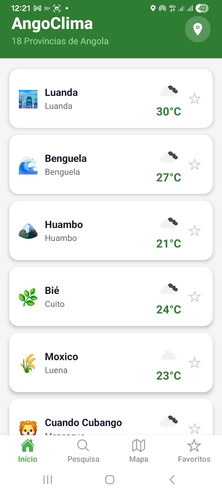
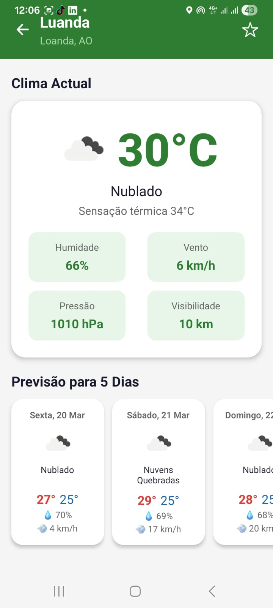

# AngoClima

Aplicacao movel de meteorologia focada nas **18 provincias de Angola**, desenvolvida com React Native e Expo. Permite consultar o clima actual e previsao de 5 dias para qualquer capital provincial angolana, pesquisar cidades em todo o mundo e localizar lugares directamente num mapa interactivo.

---

## Telas

### Inicio - `HomeScreen`



Lista completa das 18 provincias de Angola com a temperatura actual de cada capital. Os dados sao carregados em paralelo (em lotes de 5 para evitar limites de API). Suporta pull-to-refresh e permite marcar provincias como favoritas. O botao de localizacao no cabecalho detecta a posicao do utilizador e navega directamente para os detalhes da cidade mais proxima.

### Detalhes - `DetailScreen`



Ecra de detalhe com o clima actual (temperatura, humidade, vento, descricao) e a previsao para os proximos 5 dias em scroll horizontal. Suporta animacao de entrada e permite adicionar/remover a cidade dos favoritos directamente no cabecalho.

### Pesquisa - `SearchScreen`
Barra de pesquisa com debounce de 500 ms que consulta cidades em todo o mundo. Mostra um historico das ultimas 5 pesquisas (persistido no AsyncStorage) e um botao para usar a localizacao actual.

### Mapa - `MapScreen`
Mapa interactivo centrado em Angola. Permite pesquisar qualquer cidade e ver o marcador correspondente no mapa com animacao suave. Um cartao flutuante aparece com o nome do lugar seleccionado e um botao directo para ver o clima dessa localizacao.

### Favoritos - `FavoritesScreen`
Lista das cidades guardadas como favoritas com os respectivos dados meteorologicos carregados automaticamente ao entrar no ecra. Suporta pull-to-refresh e permite remover favoritos individualmente.

---

## Arquitectura

```
src/
├── api/
│   └── config.ts               # Configuracao base da API (OpenWeatherMap)
├── app/
│   ├── index.tsx                # Ponto de entrada da aplicacao
│   ├── navigation/
│   │   └── AppNavigator.tsx     # Stack + Tab navigator
│   └── screens/
│       ├── HomeScreen.tsx
│       ├── SearchScreen.tsx
│       ├── MapScreen.tsx
│       ├── DetailScreen.tsx
│       └── FavoritesScreen.tsx
├── components/
│   ├── ProvinceCard.tsx         # Card de provincia na lista inicial
│   ├── WeatherCard.tsx          # Card com dados meteorologicos detalhados
│   ├── ForecastItem.tsx         # Item da previsao de 5 dias
│   └── SearchBar.tsx            # Barra de pesquisa reutilizavel
├── hooks/
│   ├── useWeather.ts            # Fetch e estado do clima actual
│   ├── useForecast.ts           # Fetch e estado da previsao
│   └── useLocation.ts           # Geolocalizacao do dispositivo
├── services/
│   ├── weatherService.ts        # Chamadas a API de clima actual
│   ├── forecastService.ts       # Chamadas a API de previsao
│   └── geoService.ts            # Pesquisa geografica de cidades
├── store/
│   └── favoritesStore.ts        # Estado global dos favoritos (Zustand)
└── types/
    └── weather.types.ts         # Tipos e interfaces TypeScript
```

A navegacao e composta por um **Stack Navigator** na raiz (para o ecra de detalhes) que contem um **Tab Navigator** com as quatro tabs principais. A logica de negocio e separada em hooks e services, mantendo os ecras focados na apresentacao. O estado global dos favoritos e gerido com Zustand e persistido com AsyncStorage.

---

## Tecnologias

| Tecnologia | Versao | Uso |
|---|---|---|
| React Native | 0.81.5 | Framework movel |
| Expo | ~54.0.33 | Toolchain e runtime |
| TypeScript | ^5.3.3 | Tipagem estatica |
| React Navigation | ^6 | Navegacao (Stack + Bottom Tabs) |
| Zustand | ^5.0.2 | Gestao de estado global |
| AsyncStorage | 2.2.0 | Persistencia local (favoritos e historico) |
| react-native-maps | 1.20.1 | Mapa interactivo |
| expo-location | ~19.0.8 | Geolocalizacao do dispositivo |
| expo-linear-gradient | ~15.0.8 | Gradientes visuais |
| react-native-safe-area-context | 5.6.2 | Margens seguras (notch e barra do sistema) |
| react-native-reanimated | ~4.1.6 | Animacoes nativas |
| @expo/vector-icons | ^15.1.1 | Icones (Ionicons) |
| OpenWeatherMap API | - | Dados meteorologicos e geocodificacao |
